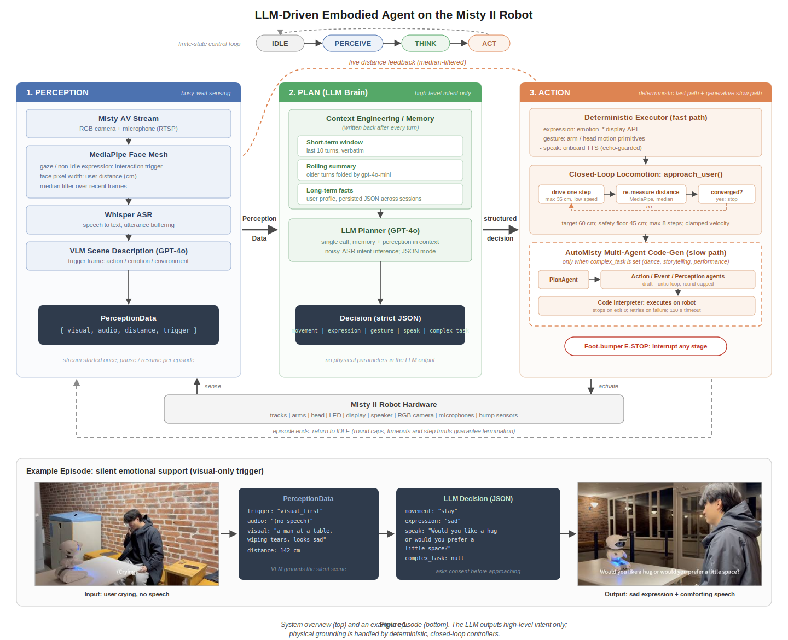
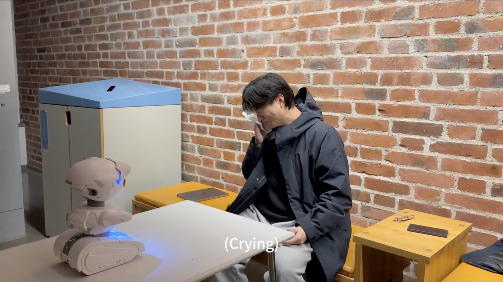
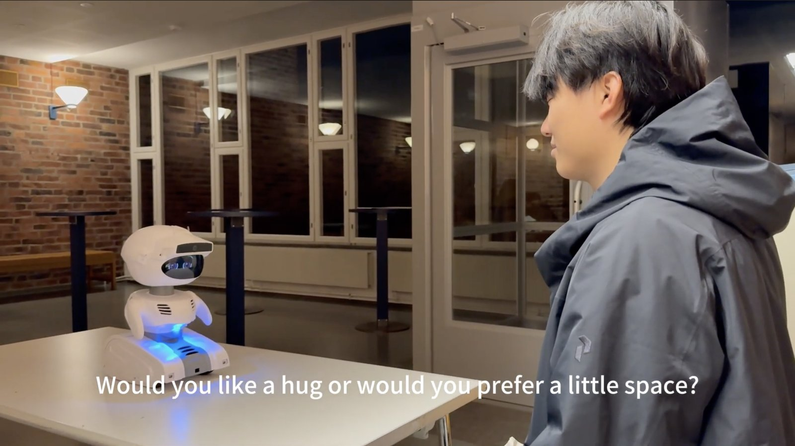
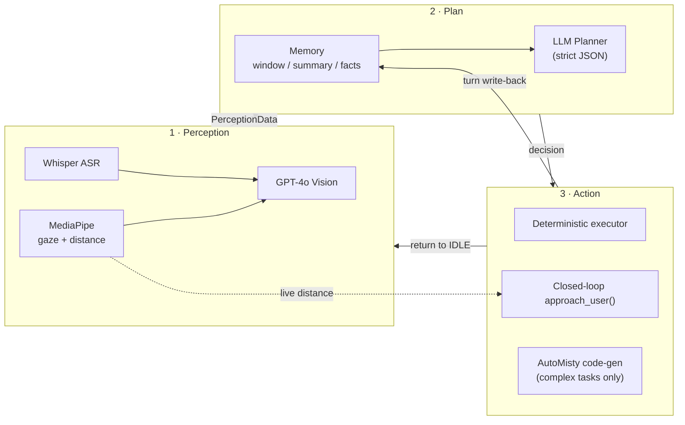

# Misty Embodied Agent

**An LLM-driven embodied AI on the Misty II social robot — perception, planning, and action in a bounded, simulation-tested control loop.**

The robot watches and listens for a human (MediaPipe + Whisper), reasons about what it perceives with GPT-4o (grounded by a three-tier conversation memory), and acts through a deterministic executor with **closed-loop locomotion** — falling back to [AutoMisty](https://arxiv.org/abs/2503.06791) multi-agent code generation only for complex expressive tasks.

<p align="center">
  
</p>

---

## Demo: silent emotional support

No speech at all — the interaction is triggered purely by vision. The VLM grounds the scene ("a man wiping tears"), the planner decides on a sad expression and a comforting sentence, and Misty **asks for consent before approaching**.

| Input — user is crying (no speech) | Output — sad expression + comforting speech |
|:---:|:---:|
|  |  |

```jsonc
// Actual planner output for this episode
{
  "thought":     "The user appears distressed and is crying silently.",
  "movement":    "stay",                 // asks consent before closing distance
  "expression":  "sad",
  "gesture":     "none",
  "speak":       "Would you like a hug or would you prefer a little space?",
  "complex_task": null
}
```

---

## Highlights

**1. The LLM never touches physical parameters.**
Misty's `drive` velocity is a *percentage of max speed*, not a physical unit — letting an LLM compute "velocity x time" open-loop is a recipe for overshoot. Here the planner outputs only high-level intent (`approach / stay / back_up`); a closed-loop controller (`approach_user()`) drives in small bounded steps, re-measures the user distance with a median filter after every step, and converges to a 60 cm social distance with a 45 cm hard safety floor. Simulation shows it stays within tolerance even with **50% calibration error**, where an open-loop scheme would overshoot by ~45 cm.

**2. Three-tier conversation memory.**
A verbatim short-term window (last 10 turns), a rolling summary that old turns get folded into (token-bounded), and long-term user facts (name, preferences) extracted each turn and **persisted across sessions** as JSON. The planner receives all three tiers in context — Misty remembers your name tomorrow.

**3. Bounded execution everywhere (System 1 / System 2 action split).**
Common reactions (expression, gestures, speech, approach) run on a deterministic *fast path* — sub-second, no code generation. Only elaborate performances (dance, storytelling) route to the AutoMisty *slow path*, whose agent loops are round-capped, timeout-guarded, and terminate immediately on successful code execution (`exitcode: 0`). Every episode provably returns to IDLE.

**4. Simulation-tested control logic.**
A 28-case test suite runs the *real* control code against a simulated 1-D world with configurable true speed, measurement noise, and target loss — no hardware, no API key, no heavy dependencies required.

---

## Architecture

The system is a finite-state loop: `IDLE -> PERCEIVE -> THINK -> ACT -> IDLE`.

**Perception** — Misty's AV stream is started once per process. A MediaPipe face-mesh watchdog detects gaze (interaction trigger) and estimates user distance from face pixel width (median-filtered over recent frames). Whisper transcribes speech with silence-based utterance buffering; GPT-4o vision describes the trigger frame. During actions, perception is *paused, not stopped*: distance keeps updating for the closed-loop controller, but no new events fire — which also prevents Misty from hearing its own speech.

**Plan** — a single structured GPT-4o call. Input: the memory block plus current perception. Output: strict JSON (`movement | expression | gesture | speak | complex_task`), sanitized against a whitelist so malformed model output degrades to safe defaults instead of crashing.

**Action** — the deterministic executor maps intent to Misty's API (`emotion_*` displays, arm/head motion primitives, onboard TTS) and runs the closed-loop approach. `complex_task` (when set) is handed to AutoMisty's planner/coder/critic agents, which generate and execute Python on the robot. A foot-bumper e-stop can interrupt any stage.



---

## Quick start

**Requirements:** Python 3.10+, a Misty II robot on the same network, an OpenAI API key.

```bash
git clone https://github.com/<you>/misty-embodied-agent.git
cd misty-embodied-agent
pip install -r requirements.txt

# Configure (never commit the real file — it is gitignored)
cp OAI_CONFIG_LIST.json.example OAI_CONFIG_LIST.json
#   -> fill in your api_key and your robot's misty_ip

# Set the robot IP in full_robot_v3.py (ROBOT_IP), then:
python full_robot_v3.py
```

Look at Misty or start talking — the loop takes it from there. Press Misty's foot bumper at any time for an emergency stop.

---

## Testing without a robot

**Simulation suite (free, offline, no dependencies beyond the stdlib):**

```bash
python test_sim.py
# Result: 28 passed, 0 failed
```

It exercises the real `approach_user()` logic against a simulated world — convergence under calibration error and sensor noise, safety-floor behavior, target loss, step caps — plus brain output sanitization, memory folding/persistence, and AutoMisty termination semantics.

**Live pipeline test (real GPT-4o, fake robot, ~a few cents):**

```bash
export OPENAI_API_KEY=sk-...
python test_llm_live.py
```

Four scripted scenarios (the crying demo, a self-introduction, a memory-recall probe, a dance request) run through the real planner; every hardware call is logged, and the closed loop converges on simulated kinematics. Scenario 3's reply containing the name from Scenario 2 is direct evidence the memory system works.

---

## Hardware calibration (one-time)

1. **Drive speed** — run `drive_time(linearVelocity=20, angularVelocity=0, timeMs=2000)`, measure the traveled centimeters, divide by 2, and set `CM_PER_SEC_AT_PERCENT`. The closed loop tolerates large errors here; calibration just reduces step count.
2. **Camera focal constant** — stand at a measured 100 cm and compare the reported distance; scale `FOCAL_LENGTH` proportionally.
3. Verify the motors actually move at 20% (`DRIVE_PERCENT`); raise it if they stall below the deadband.

---

## Project structure

```
.
├── full_robot_v3.py          # Main entry: FSM, memory, brain, executor, closed loop
├── AutoMisty.py              # AutoMisty entry point (complex_action)
├── Agents/                   # AutoMisty multi-agent framework (plan/action/event/perception)
├── CUBS_Misty.py             # Misty II Python driver (AV stream, Whisper, events)
├── RobotCommands.py          # Low-level Misty REST commands
├── code/mistyPy/             # AutoMisty's sandbox: generated scripts run here
│                             #   (contains its own driver copies — keep in sync)
├── test_sim.py               # 28-case hardware-free simulation suite
├── test_llm_live.py          # Real-LLM pipeline test on a fake robot
├── Mistydemo/                # Example task scripts
└── assets/                   # Architecture figure & demo photos
```

Note: `CUBS_Misty.py` / `RobotCommands.py` exist both at the root (imported by the main program) and inside `code/mistyPy/` (imported by AutoMisty-generated scripts, which execute in that working directory). If you modify the driver, update both copies.

---

## Roadmap

- **Skill caching** — reuse previously generated AutoMisty scripts for semantically similar tasks instead of regenerating.
- **Anthropic API backend** — pluggable LLM provider for the planner/memory path.
- Angular closed loop (turn-to-face using the face-center offset already computed by MediaPipe).

---

## Acknowledgements & license

- Code generation is built on **AutoMisty** (Wang, Dong, Rangasrinivasan, Nwogu, Setlur, Govindaraju — *AutoMisty: A Multi-Agent LLM Framework for Automated Code Generation in the Misty Social Robot*, IROS 2025, [arXiv:2503.06791](https://arxiv.org/abs/2503.06791)). The AutoMisty-derived components (`Agents/`, `AutoMisty.py`, and the optimized Misty API) are used under the upstream **Academic Research License**: academic and non-commercial use only, citation required.
- Misty II robot and REST API by [Misty Robotics](https://www.mistyrobotics.com/).
- Face tracking by [MediaPipe](https://developers.google.com/mediapipe); speech recognition by [OpenAI Whisper](https://github.com/openai/whisper).

The original components of this repository (main control loop, memory system, closed-loop controller, test suites) are released for academic and non-commercial use under the same terms, to remain compatible with the upstream license.

```bibtex
@inproceedings{wang2025automisty,
  title     = {AutoMisty: A Multi-Agent LLM Framework for Automated Code Generation in the Misty Social Robot},
  author    = {Wang, Xiao and Dong, Lu and Rangasrinivasan, Sahana and Nwogu, Ifeoma and Setlur, Srirangaraj and Govindaraju, Venugopal},
  booktitle = {IEEE/RSJ International Conference on Intelligent Robots and Systems (IROS)},
  year      = {2025}
}
```
