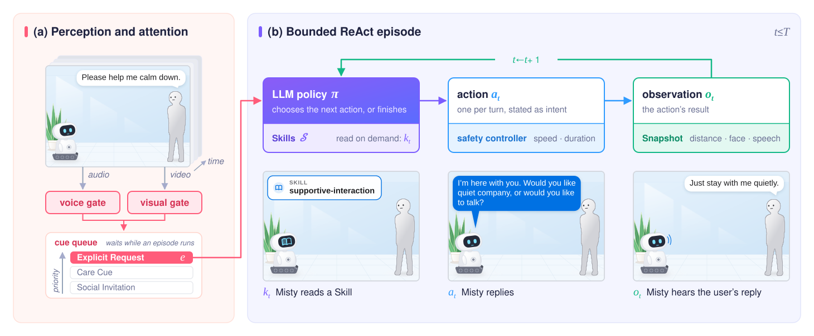
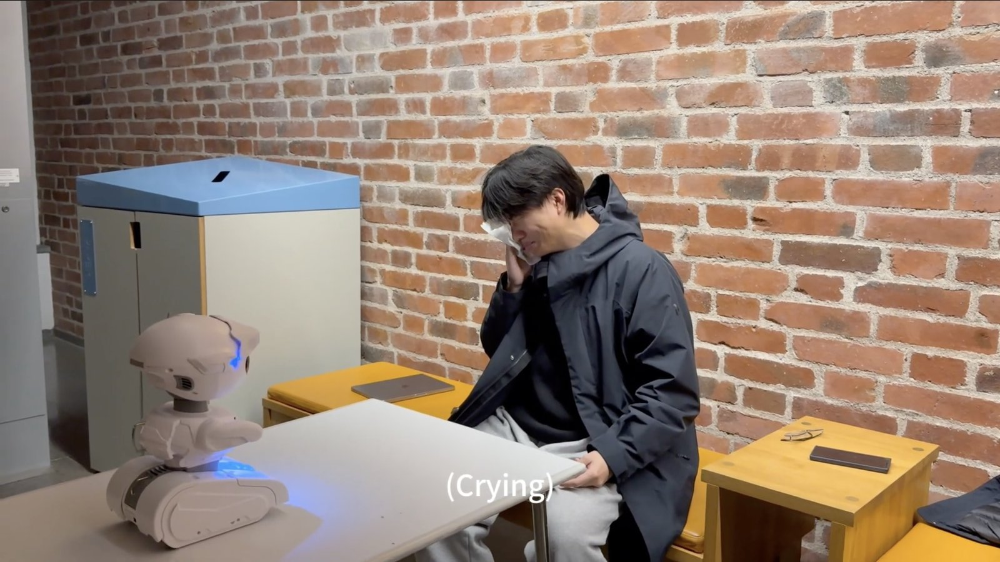
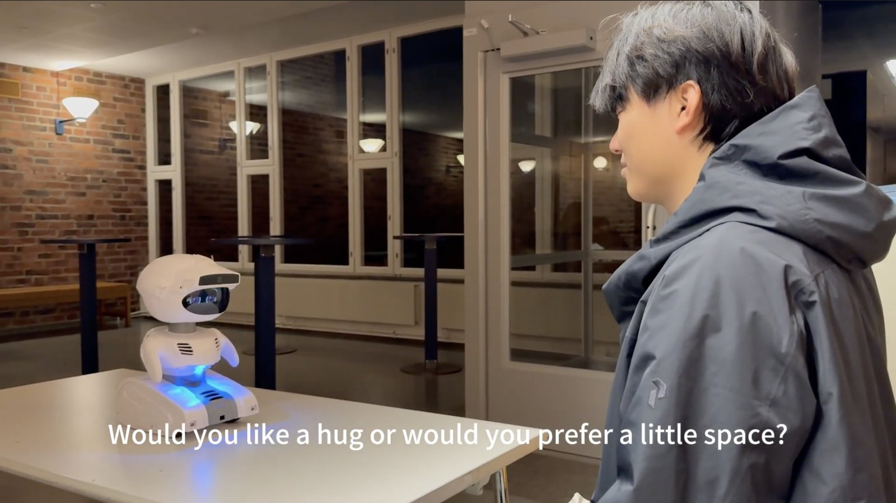
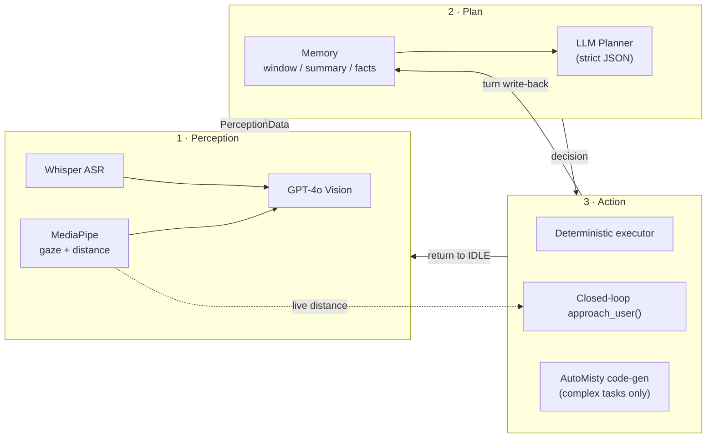

# Misty Embodied Agent

**An LLM-driven embodied AI on the Misty II social robot — perception, planning, and action in a bounded, simulation-tested control loop.**

The robot watches and listens for a human (MediaPipe + Whisper), reasons about what it perceives with GPT-4o (grounded by a three-tier conversation memory), and acts through a deterministic executor with **closed-loop locomotion** — falling back to [AutoMisty](https://arxiv.org/abs/2503.06791) multi-agent code generation only for complex expressive tasks.

<p align="center">
  
</p>

---

## Demo: silent emotional support

No speech at all — the interaction is triggered purely by vision. The VLM grounds the scene ("a man wiping tears"), the planner decides on a sad expression and a comforting sentence, and Misty **asks for consent before approaching**.

| Input — user is crying (no speech) | Output — sad expression + comforting speech |
|:---:|:---:|
|  |  |

```jsonc
// Actual planner output for this episode
{
  "thought":     "The user appears distressed and is crying silently.",
  "movement":    "stay",                 // asks consent before closing distance
  "expression":  "sad",
  "gesture":     "none",
  "speak":       "Would you like a hug or would you prefer a little space?",
  "complex_task": null
}
```

---

## Highlights

**1. The LLM never touches physical parameters.**
Misty's `drive` velocity is a *percentage of max speed*, not a physical unit — letting an LLM compute "velocity x time" open-loop is a recipe for overshoot. Here the planner outputs only high-level intent (`approach / stay / back_up`); a closed-loop controller (`approach_user()`) drives in small bounded steps, re-measures the user distance with a median filter after every step, and converges to a 60 cm social distance with a 45 cm hard safety floor. Simulation shows it stays within tolerance even with **50% calibration error**, where an open-loop scheme would overshoot by ~45 cm.

**2. Three-tier conversation memory.**
A verbatim short-term window (last 10 turns), a rolling summary that old turns get folded into (token-bounded), and long-term user facts (name, preferences) extracted each turn and **persisted across sessions** as JSON. The planner receives all three tiers in context — Misty remembers your name tomorrow.

**3. Bounded execution everywhere (System 1 / System 2 action split).**
Common reactions (expression, gestures, speech, approach) run on a deterministic *fast path* — sub-second, no code generation. Only elaborate performances (dance, storytelling) route to the AutoMisty *slow path*, whose agent loops are round-capped, timeout-guarded, and terminate immediately on successful code execution (`exitcode: 0`). Every episode provably returns to IDLE.

**4. Simulation-tested control logic.**
A pytest suite runs the *real* control code through its public interface against synthetic frames, a simulated 1-D world and a recording robot adapter — convergence under calibration error, target loss, step caps — with no hardware and no API key required. Reading noise is **not** covered yet; see `docs/measurements/m6-coverage-audit.md`.

---

## Architecture

The system is a finite-state loop: `IDLE -> PERCEIVE -> THINK -> ACT -> IDLE`.

**Perception** — Misty's AV stream is started once per process. A MediaPipe face-mesh watchdog detects gaze (interaction trigger) and estimates user distance from face pixel width (median-filtered over recent frames). Whisper transcribes speech with silence-based utterance buffering; GPT-4o vision describes the trigger frame. During actions, perception is *paused, not stopped*: distance keeps updating for the closed-loop controller, but no new events fire — which also prevents Misty from hearing its own speech.

**Plan** — a single structured GPT-4o call. Input: the memory block plus current perception. Output: strict JSON (`movement | expression | gesture | speak | complex_task`), sanitized against a whitelist so malformed model output degrades to safe defaults instead of crashing.

**Action** — the deterministic executor maps intent to Misty's API (`emotion_*` displays, arm/head motion primitives, onboard TTS) and runs the closed-loop approach. `complex_task` (when set) is handed to AutoMisty's planner/coder/critic agents, which generate and execute Python on the robot. A foot-bumper e-stop can interrupt any stage.


```mermaid
flowchart LR
    subgraph P["1 · Perception"]
        MP["MediaPipe<br>gaze + distance"] --> VLM["GPT-4o Vision"]
        ASR["Whisper ASR"] --> VLM
    end
    subgraph B["2 · Plan"]
        MEM["Memory<br>window / summary / facts"] --> LLM["LLM Planner<br>(strict JSON)"]
    end
    subgraph A["3 · Action"]
        EXE["Deterministic executor"]
        LOOP["Closed-loop approach_user()"]
        AM["AutoMisty code-gen<br>(complex tasks only)"]
    end
    P -->|PerceptionData| B -->|decision| A
    MP -.->|live distance| LOOP
    A -->|turn write-back| MEM
    A -->|return to IDLE| P
```

---

## Quick start

**Requirements:** Python 3.10+, a Misty II robot on the same network, an OpenAI API key.

```bash
git clone https://github.com/jyp-studio/misty-llm-embodied-agent.git
cd misty-llm-embodied-agent
pip install -r requirements.txt

# Configure (never commit the real file — it is gitignored)
cp OAI_CONFIG_LIST.json.example OAI_CONFIG_LIST.json
#   -> fill in your api_key
export OPENAI_API_KEY=sk-...        # or leave it to the file above

cp .env.example .env
#   -> set MISTY_ROBOT_IP to your robot's address
```

An Episode is one trigger and the decisions that follow it: `misty_agent.app.Session.episode("speech", "come here")` runs one and hands back the Journal it produced. There is no "wait until somebody speaks" loop yet, and that is a decision rather than an omission — the audio stream's transcription and voice detection still share a thread (`HANDOFF.md` §4), and building the outer loop on that would be building on a known defect.

Press Misty's foot bumper at any time: the motors halt, the Episode ends as `aborted`, and the moment it happened is on the Journal.

---

## Testing without a robot

**Simulation suite (free, offline, no robot and no API key):**

```bash
.venv/bin/python -m pytest tests/ -q -rs
```

It runs in the project virtualenv, not a bare `python3` — see `AGENTS.md` for
how to build it and why the wrong interpreter reports green while silently
skipping every perception test. The count is deliberately not pinned here; the
suite is the source of truth for its own size.

It exercises the real closed-loop `approach()` through its public interface — convergence under calibration error, safety-floor behaviour inside an explicitly uncalibrated motion assumption, target loss at startup, step caps — plus the driver contract tests and the perception pipeline against real pixels.

Two things it does **not** cover, both recorded rather than hidden: reading noise, and losing the user *after* the robot has already moved. `docs/measurements/m6-coverage-audit.md` itemises every check the previous simulation runner carried and where it went.

**Live model suite (real GPT-4o, fake robot, ~a few cents):**

```bash
export OPENAI_API_KEY=sk-...
.venv/bin/python -m pytest -m llm_live
```

Deselected from the default run, so an ordinary `pytest` never reaches the network and never reports a skip.

It asserts **invariants, not answers**: the Episode terminates, the Turn cap holds, no velocity or drive duration ever reaches the model, every Tool call is in range, and every drive came from the closed-loop controller. What the model *chose* is deliberately not a gate — a model that looks around before replying is not a bug — so behavioural observations are counted and reported as a rate instead.

Every one of those gates is proven able to fail in `tests/test_episode_invariants.py`, which runs offline for free. Without that, a vacuous check in a suite nobody runs in CI would pass forever.

---

## Hardware calibration (one-time)

1. **Drive speed** — run `drive_time(linearVelocity=20, angularVelocity=0, timeMs=2000)`, measure the traveled centimeters, divide by 2, and set `CM_PER_SEC_AT_PERCENT`. The closed loop tolerates large errors here; calibration just reduces step count.
2. **Camera focal constant** — stand at a measured 100 cm and compare the reported distance; scale `FOCAL_LENGTH` proportionally.
3. Verify the motors actually move at 20% (`DRIVE_PERCENT`); raise it if they stall below the deadband.

---

## Project structure

```
.
├── misty_agent/
│   ├── app.py                # Entry: wires drivers, agent and memory into one Episode
│   ├── config.py             # Every tunable, with UNCALIBRATED ones marked as such
│   ├── agent/                # journal, react, tools, memory, stop, layering, model
│   ├── control/              # approach() and the step policy — the closed loop
│   ├── drivers/              # Misty REST, RTSP audio/video, websocket events
│   ├── perception/           # face, distance, speech
│   └── fakes/                # stand-ins: no Misty II was available to this project
├── harness/                  # python -m harness — regenerates the M5 and M6 reports
├── tests/                    # goldens/ holds four Journals committed before the loop
├── docs/measurements/        # the evidence those reports produce, under version control
├── PLAN.md                   # every decision and why, including the reversed ones
├── CONTEXT.md                # the glossary; Turn, Step and Episode are not synonyms
├── HANDOFF.md                # what the next person needs, including what is still broken
└── assets/                   # architecture figure & demo photos
```

The AutoMisty framework this began as (`AutoMisty.py`, `Agents/`, `CUBS_Misty.py`, `Mistydemo/`) was removed from version control at M1 and lives in `legacy/`, which is gitignored. `PLAN.md` §2–§3 records what was excised and why.

---

## Roadmap

- **Skill caching** — reuse previously generated AutoMisty scripts for semantically similar tasks instead of regenerating.
- **Anthropic API backend** — pluggable LLM provider for the planner/memory path.
- Angular closed loop (turn-to-face using the face-center offset already computed by MediaPipe).

---

## Acknowledgements & license

- Code generation is built on **AutoMisty** (Wang, Dong, Rangasrinivasan, Nwogu, Setlur, Govindaraju — *AutoMisty: A Multi-Agent LLM Framework for Automated Code Generation in the Misty Social Robot*, IROS 2025, [arXiv:2503.06791](https://arxiv.org/abs/2503.06791)). The AutoMisty-derived components (`Agents/`, `AutoMisty.py`, and the optimized Misty API) are used under the upstream **Academic Research License**: academic and non-commercial use only, citation required.
- Misty II robot and REST API by [Misty Robotics](https://www.mistyrobotics.com/).
- Face tracking by [MediaPipe](https://developers.google.com/mediapipe); speech recognition by [OpenAI Whisper](https://github.com/openai/whisper).

The original components of this repository (main control loop, memory system, closed-loop controller, test suites) are released for academic and non-commercial use under the same terms, to remain compatible with the upstream license.

```bibtex
@inproceedings{wang2025automisty,
  title     = {AutoMisty: A Multi-Agent LLM Framework for Automated Code Generation in the Misty Social Robot},
  author    = {Wang, Xiao and Dong, Lu and Rangasrinivasan, Sahana and Nwogu, Ifeoma and Setlur, Srirangaraj and Govindaraju, Venugopal},
  booktitle = {IEEE/RSJ International Conference on Intelligent Robots and Systems (IROS)},
  year      = {2025}
}
```
