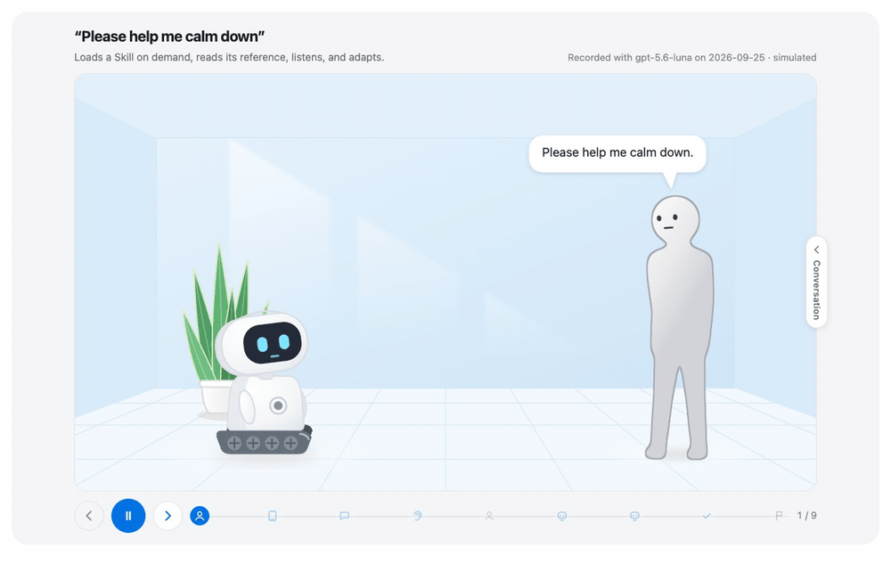
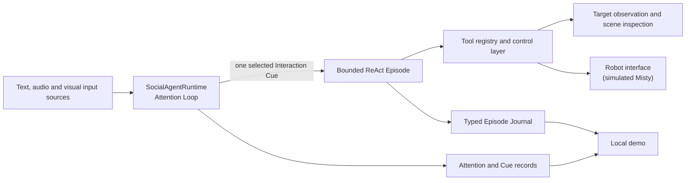

# Misty Embodied Agent

An embodied agent for the Misty II social robot in which a language model
decides what the robot does. The model acts one tool call at a time inside a
bounded ReAct loop, and an attention loop in front of it decides whether an
interaction should begin at all.

**No Misty II has ever been available to this project, and none will be.**
Every behaviour described here runs against simulated or recorded adapters.
The request shapes of the real drivers are covered by contract tests, while
physical behaviour, calibration, latency and safety remain hardware-unverified.

<p align="center">
  
</p>

<p align="center"><em>A recorded run from the demo: asked for help calming down, Misty loads
a Skill, offers a choice, listens, and adapts to the answer.</em></p>

## Highlights

- **Attention comes before action.** A runtime reads its input sources and
  turns what it notices into Interaction Cues: an Explicit Request (a wake
  phrase or a direct request), a Social Invitation (a sustained look and a
  wave), or an uncertain Care Cue (sustained observable face and posture
  geometry). Cues are queued by priority and freshness, and only one Episode
  owns the robot at a time.
- **Each Episode is a bounded ReAct loop.** On every Turn the model chooses
  one typed Tool, receives its result together with a small perception
  Snapshot, and decides again. The model ends the Episode itself, and a hard
  cap of twelve Turns guarantees that it ends.
- **The model decides whether, and the control layer decides how.** The
  model can ask to approach a person and choose how much room to leave them
  (`close`, `comfortable` or `far`). A closed loop aligns the chassis, moves
  in bounded steps from fresh readings, and stops at the first checkpoint
  that reports a stop request or a hazard. No velocity, duration or drive
  command ever reaches the model.
- **Every Episode leaves a typed Journal.** Tool calls, observations,
  snapshots and short public Decision Notes are recorded as typed records.
  The model is never asked for its private reasoning, and none is stored.
- **Skills load on demand.** Local Skills expose only their names and
  descriptions at first. Their instructions and reference files load when the
  model activates them, for the current Episode only, and a Skill can never
  run code or bypass a Tool.
- **Boundaries are part of the design.** Misty answers in the language the
  person is using. In a high-risk moment it stays, says plainly what it cannot
  do, and points to someone nearby or to local emergency services. It never
  diagnoses, promises safety or claims to have contacted anyone, and no Tool
  can reach anyone outside the room.
- **Social context is ephemeral.** Context is kept within one Episode and
  discarded afterwards. The optional persistent Journal redacts personal
  prose.

## The demo

```bash
.venv/bin/python -m misty_agent --demo
```

The page runs on this machine only and needs neither a robot nor an API key.
It plays fifteen recorded runs of a hosted model (`gpt-5.6-luna`) in five
groups: noticing someone, talking, moving, care, and knowing its limits. Each
run uses the inputs, timing and simulated room of an acceptance scenario,
with every decision made by the model, and each is labelled with the model
and the date it was recorded.

An animated Misty stands on a small stage. Speech appears in bubbles over the
speaker, the model's Decision Notes appear as thought clouds, and the stage
shows what Misty is doing and sensing, the distance between Misty and the
person, Skills being loaded, and sounds being played. The full conversation
opens in a panel on the right of the stage. The **Try it live** panel sends
your own sentence to the hosted model and plays the result on the same stage.

To record the examples again with the configured model (this needs an API key
and costs a small amount):

```bash
.venv/bin/python -m misty_agent.demo.record
```

## Architecture


```mermaid
flowchart LR
    INPUT["Text, audio and visual input sources"] --> RUNTIME["SocialAgentRuntime<br>Attention Loop"]
    RUNTIME -->|"one selected Interaction Cue"| EPISODE["Bounded ReAct Episode"]
    EPISODE --> TOOLS["Tool registry and control layer"]
    TOOLS --> PERCEPTION["Target observation and scene inspection"]
    TOOLS --> ROBOT["Robot interface<br>(simulated Misty)"]
    EPISODE --> JOURNAL["Typed Episode Journal"]
    RUNTIME --> TRACE["Attention and Cue records"]
    TRACE --> DEMO["Local demo"]
    JOURNAL --> DEMO
```

[docs/architecture.md](docs/architecture.md) describes the current system in
full. [PLAN.md](PLAN.md) keeps the complete decision history, including the
decisions that were later reversed. [CONTEXT.md](CONTEXT.md) defines the
project's vocabulary, where Turn, Step and Episode have distinct meanings, and
[docs/adr/](docs/adr/) records the decisions that are hard to reverse.
[HANDOFF.md](HANDOFF.md) states where the work currently stands.

## Getting started

The project targets Python 3.11. Create the virtual environment and install
the pinned dependencies:

```bash
python3.11 -m venv .venv
.venv/bin/python -m pip install --only-binary=:all: -r requirements.txt
```

Always run the project through `.venv`. A bare `python3` without MediaPipe
and OpenCV still reports a passing test suite, because the perception tests
skip instead of failing. [AGENTS.md](AGENTS.md) explains how to recognise this.

The demo and the offline test suite need no API key. The live panel, the
command line and the recorder read the OpenAI key from the `OPENAI_API_KEY`
environment variable or from `OAI_CONFIG_LIST.json` in the project root.
Both are ignored by git. Copy the example file and replace the placeholder:

```bash
cp OAI_CONFIG_LIST.json.example OAI_CONFIG_LIST.json
```

The key does not belong in `.env`, which holds only the `MISTY_` settings
listed in `.env.example`.

The command line runs one scenario through the same runtime as the demo:

```bash
.venv/bin/python -m misty_agent --said "Misty, hello"
```

`--robot <IP>` assembles the real driver path and prints a warning each time.
It has never run against a robot, and its presence is not evidence that it
works.

## Testing

The default suite runs offline and makes no network or model calls:

```bash
.venv/bin/python -m pytest tests/ -q -rs
```

It exercises the real closed-loop approach through its public interface, the
driver contract tests, the perception pipeline against real pixels, and the
fifteen acceptance scenarios, which run with authored model decisions so that
every run is the same. The scenarios set a floor under behaviour; they are
not a benchmark and produce no score. The suite also checks every recorded
demo run with the same boundary audit that is applied to live model output.

A separate suite runs against the real hosted model with a fake robot. It
costs a few cents at most and is excluded from the default run:

```bash
.venv/bin/python -m pytest -m llm_live
```

It asserts invariants rather than answers: the Episode ends, the Turn cap
holds, no control parameter reaches the model, every Tool call is in range,
and every drive comes from the closed-loop controller.
`tests/test_episode_invariants.py` proves offline that each of these checks
is able to fail.

## Evidence boundary

Motion constants and sensor assumptions are marked `UNCALIBRATED` in
`misty_agent/config.py`. The simulated world and the replay harness prove
software properties under declared assumptions; they do not show what a
physical Misty would do. The wake path has run only with synthetic audio, the
visual gates only with synthetic frame timelines, and the recorded demo runs
are evidence about one model on one day. None of this is installation or
safety guidance for real hardware.

## Project structure

```
.
├── misty_agent/
│   ├── runtime.py          # Attention Loop, Cues, Episodes and shutdown
│   ├── audio_input.py      # local wake gate, bounded capture, hosted ASR
│   ├── visual_input.py     # local visual gates for invitations and care cues
│   ├── scenarios.py        # scenario scripts shared by the demo and the tests
│   ├── acceptance.py       # the fifteen acceptance contracts and their runner
│   ├── app.py              # composition root for sessions and the command line
│   ├── config.py           # every tunable, with uncalibrated values marked
│   ├── agent/              # ReAct loop, Tools, Journal, persona, model adapter
│   ├── control/            # the closed-loop approach and its step policy
│   ├── robot/              # one Robot interface, real and simulated adapters
│   ├── drivers/            # Misty REST, RTSP audio and video, websocket events
│   ├── perception/         # face, distance, speech and active perception
│   ├── skills/             # local Skills loaded on demand
│   ├── demo/               # the demo page, its server and the recordings
│   └── fakes/              # stand-ins for the robot and its services
├── harness/                # replay harness and measurement reports
├── tests/                  # offline suite; goldens/ holds the reference Journals
├── docs/                   # architecture, decision records and measurements
├── .scratch/               # specifications and tickets
├── PLAN.md                 # decision history
├── CONTEXT.md              # vocabulary
└── HANDOFF.md              # where the work stands
```

## Previous version

This repository began as a class project. That version ran a fixed loop in
which a single GPT-4o call produced a strict JSON plan for movement,
expression, gesture and speech, and it handed elaborate performances to the
AutoMisty multi-agent framework, which generated Python and executed it on
the robot. The current version replaces that design with the attention loop
and bounded ReAct Episodes described above. `PLAN.md` explains what was kept,
what was removed and why.

The previous version remains available on the `v1` branch and at the
`v1-class-project` tag for anyone who wants to compare the two approaches.
It is distributed under the AutoMisty Academic Research License, which limits
it to academic, educational and non-commercial use; the current version is
licensed under Apache 2.0.

## Next steps

The next piece of work gives Misty richer body language: reflexes played by
the runtime while the model is thinking or listening, a gesture chosen with
each line and played while it is spoken, and deliberate actions that remain
ReAct Turns. The direction and its open questions are recorded in
[.scratch/body-language/spec.md](.scratch/body-language/spec.md).

## Acknowledgements and license

Misty II and its REST API are products of Misty Robotics. Face perception
uses MediaPipe, local wake detection uses PocketSphinx, and the hosted speech
and model adapters use OpenAI when a key is configured. The original AutoMisty
code-generation framework was removed from this version, and the retained
generated Misty SDK file is attributed in `NOTICE`.

This project is licensed under the Apache License 2.0. See `LICENSE` and
`NOTICE`.
