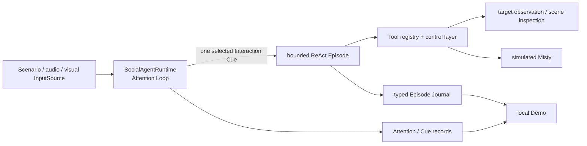

# Misty Embodied Agent

An LLM-driven embodied agent for the Misty II social robot, with a bounded
ReAct core and a simulation-first autonomous runtime.

**There is no Misty II available to this project, and there never will be.**
Every demonstrated behaviour runs against simulated or recorded adapters.
Real-driver request shapes have contract coverage; physical behaviour,
calibration, latency, and safety remain hardware-unverified.

## What works now

- `SocialAgentRuntime` is the highest product seam. It consumes a unified
  input source, creates an Interaction Cue, and gives one bounded Episode at a
  time ownership of model context and robot effects.
- The first vertical path is a timed text Explicit Request driven by
  `ScenarioInputAdapter` and a fake clock. It reaches the existing ReAct loop,
  typed Journal, Tool validation, and simulated Misty effects.
- Typed Trigger Evidence reaches the first model Turn with source, time,
  selected facts, uncertainty, transcript and an optional bounded image. The
  hosted adapter preserves native Tool call identity and matching Tool-result
  roles, rejects multiple calls in one Turn, and records short public Decision
  Notes without requesting private reasoning. Selected images are strict
  base64, capped at 8 MiB decoded, and removed from completed runtime results.
- Runtime shutdown, dependency failure, source exhaustion, and the 12-Turn
  Episode cap all close with observable bounded endings.
- The local Demo leads with three social-robot stories. Greeting and care are
  runnable through the current runtime and Journal seam; A-to-B handoff
  remains a visibly locked ticket 08 preview rather than a scripted stand-in.
- A temporal local visual gate can form an uncertain Care Cue from sustained
  observable eye, mouth and head geometry. The model may choose cheap target
  observation, expensive scene inspection, a question, or no intervention;
  the gate never diagnoses emotion or fixes the response sequence.
- Cross-Episode personal memory is not a current product capability. Social
  state is ephemeral unless a future consent-based policy explicitly changes it.

The concise source of truth is [docs/architecture.md](docs/architecture.md).
`PLAN.md` preserves the longer decision history.


```mermaid
flowchart LR
    INPUT["Scenario / audio / visual InputSource"] --> RUNTIME["SocialAgentRuntime<br>Attention Loop"]
    RUNTIME -->|"one selected Interaction Cue"| EPISODE["bounded ReAct Episode"]
    EPISODE --> TOOLS["Tool registry + control layer"]
    TOOLS --> PERCEPTION["target observation / scene inspection"]
    TOOLS --> SIM["simulated Misty"]
    EPISODE --> JOURNAL["typed Episode Journal"]
    RUNTIME --> TRACE["Attention / Cue records"]
    TRACE --> DEMO["local Demo"]
    JOURNAL --> DEMO
```

## Quick start

Use the project virtual environment; a bare `python3` can silently skip the
perception suite (see `AGENTS.md`). No robot or API key is needed for the
built-in runtime scenario.

```bash
.venv/bin/python -m misty_agent --demo
```

The browser page is loopback-only. Choose the greeting or care card and select
**執行離線模擬**; it needs no API key and shows the input, cue, actual Tool
choices, Trigger Evidence, Decision Notes, matching Observations and simulated
speech produced by that run. Its input and model choices are predefined, which
the page labels directly. The separate **Live AI** panel
needs `OPENAI_API_KEY` or `OAI_CONFIG_LIST.json` and may use a hosted model.

The command-line path also crosses `SocialAgentRuntime`:

```bash
export OPENAI_API_KEY=sk-...  # omit when injecting a model in tests
.venv/bin/python -m misty_agent --said "Misty, hello"
```

`--robot <IP>` assembles the retained real-driver path and prints an explicit
warning. It has never run on hardware; its presence is not evidence that it works.

---

## Testing without a robot

**Simulation suite (free, offline, no robot and no API key):**

```bash
.venv/bin/python -m pytest tests/ -q -rs
```

It runs in the project virtualenv, not a bare `python3` — see `AGENTS.md` for
how to build it and why the wrong interpreter reports green while silently
skipping every perception test. The count is deliberately not pinned here; the
suite is the source of truth for its own size.

It exercises the real closed-loop `approach()` through its public interface — convergence under calibration error, safety-floor behaviour inside an explicitly uncalibrated motion assumption, target loss at startup, step caps — plus the driver contract tests and the perception pipeline against real pixels.

Two things it does **not** cover, both recorded rather than hidden: reading noise, and losing the user *after* the robot has already moved. `docs/measurements/m6-coverage-audit.md` itemises every check the previous simulation runner carried and where it went.

**Live model suite (real GPT-4o, fake robot, ~a few cents):**

```bash
export OPENAI_API_KEY=sk-...
.venv/bin/python -m pytest -m llm_live
```

Deselected from the default run, so an ordinary `pytest` never reaches the network and never reports a skip.

It asserts **invariants, not answers**: the Episode terminates, the Turn cap holds, no velocity or drive duration ever reaches the model, every Tool call is in range, and every drive came from the closed-loop controller. What the model *chose* is deliberately not a gate — a model that looks around before replying is not a bug — so behavioural observations are counted and reported as a rate instead.

Every one of those gates is proven able to fail in `tests/test_episode_invariants.py`, which runs offline for free. Without that, a vacuous check in a suite nobody runs in CI would pass forever.

---

## Hardware evidence boundary

Motion constants and sensor assumptions are deliberately labelled
`UNCALIBRATED`. The deterministic world and replay harness prove software
properties under declared assumptions; they do not prove what a physical Misty
would do. Do not treat the retained `--robot` path as installation or safety
guidance.

---

## Project structure

```
.
├── misty_agent/
│   ├── runtime.py            # Highest seam: Attention, cues, Episodes, shutdown
│   ├── audio_input.py        # Local wake gate, bounded capture, hosted-ASR decision
│   ├── scenarios.py          # Acceptance Scenario source shared by Demo and tests
│   ├── app.py                # Composition root and one-Episode runtime dependency
│   ├── config.py             # Every tunable, with UNCALIBRATED ones marked as such
│   ├── agent/                # journal, react, tools, memory, stop, layering, model
│   ├── control/              # approach() and the step policy — the closed loop
│   ├── drivers/              # Misty REST, RTSP audio/video, websocket events
│   ├── perception/           # face, distance, speech
│   └── fakes/                # stand-ins: no Misty II was available to this project
├── harness/                  # python -m harness — regenerates the M5 and M6 reports
├── tests/                    # goldens/ holds four Journals committed before the loop
├── docs/architecture.md      # concise current architecture
├── docs/adr/                 # hard-to-reverse architecture decisions
├── docs/measurements/        # replay/simulation evidence and its limits
├── PLAN.md                   # every decision and why, including the reversed ones
├── CONTEXT.md                # the glossary; Turn, Step and Episode are not synonyms
└── HANDOFF.md                # current progress and handoff notes
```

The AutoMisty framework this began as (`AutoMisty.py`, `Agents/`, `CUBS_Misty.py`, `Mistydemo/`) was removed from version control at M1 and lives in `legacy/`, which is gitignored. `PLAN.md` §2–§3 records what was excised and why.

---

## Roadmap

The current runtime has bounded Cue scheduling, an external Hey/Hi Misty audio
gate, plus synthetic-fixture-verified Social Invitation and uncertain Care Cue
visual gates. Planned vertical slices add person-aware handoff, Skills,
ephemeral social state, and target-aware movement. See
`.scratch/social-react-runtime/` for the approved spec and tickets.

---

## Acknowledgements & license

Misty II and its REST API are by Misty Robotics. Face perception uses
MediaPipe; local wake detection uses PocketSphinx; hosted speech/model adapters
use OpenAI when explicitly configured.
The original AutoMisty code-generation framework was removed at M1; the
retained generated Misty SDK file is attributed in `NOTICE`.

This repository is Apache-2.0. See `LICENSE` and `NOTICE`.
